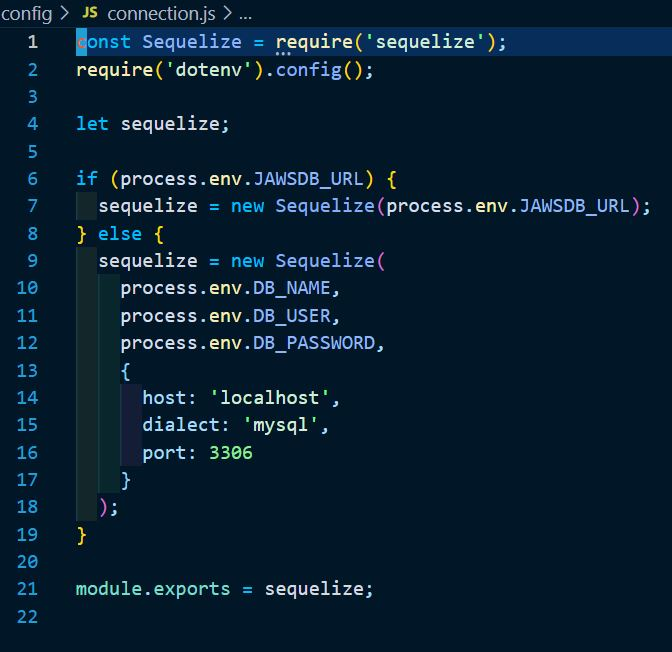

# -14-Model-View-Controller-MVC-Tech-Blog

## Introduction:
our task for this assignment was to build a CMS-style blog site similar to a Wordpress site. Where developers can publish their blog posts and comment on other developers’ posts as well. This site was completely from scratch and deployed to Heroku. The app is supposed to follow the MVC paradigm in its architectural structure. Use the following: Handlebars.js as the templating language, Sequelize as the ORM, and the express-session npm package for authentication.

I created a demo app that you can use on this link:
 [Tech Blog](https://vast-tundra-79667.herokuapp.com/)

 
 

## Technologies used:

* bcrypt
* connect-session-sequelize
* dotenv
* express
* express-handlebars
* express-session
* sequelize
* JawsDB
* Heroku
* Node
* Mysql
 
 

### Screenshot of config

 
 

### Screenshot of controllers code

 
 

### Screenshot of Models

 
 

### Screenshot of public JS

 
 

### Screenshot of seeds

 
 

### Screenshot of utils

 
 

### Screenshot of views

 
 

### Screenshot of server

### Finished Heroku app screenshot

 
 

### Finished Heroku app screenshot

